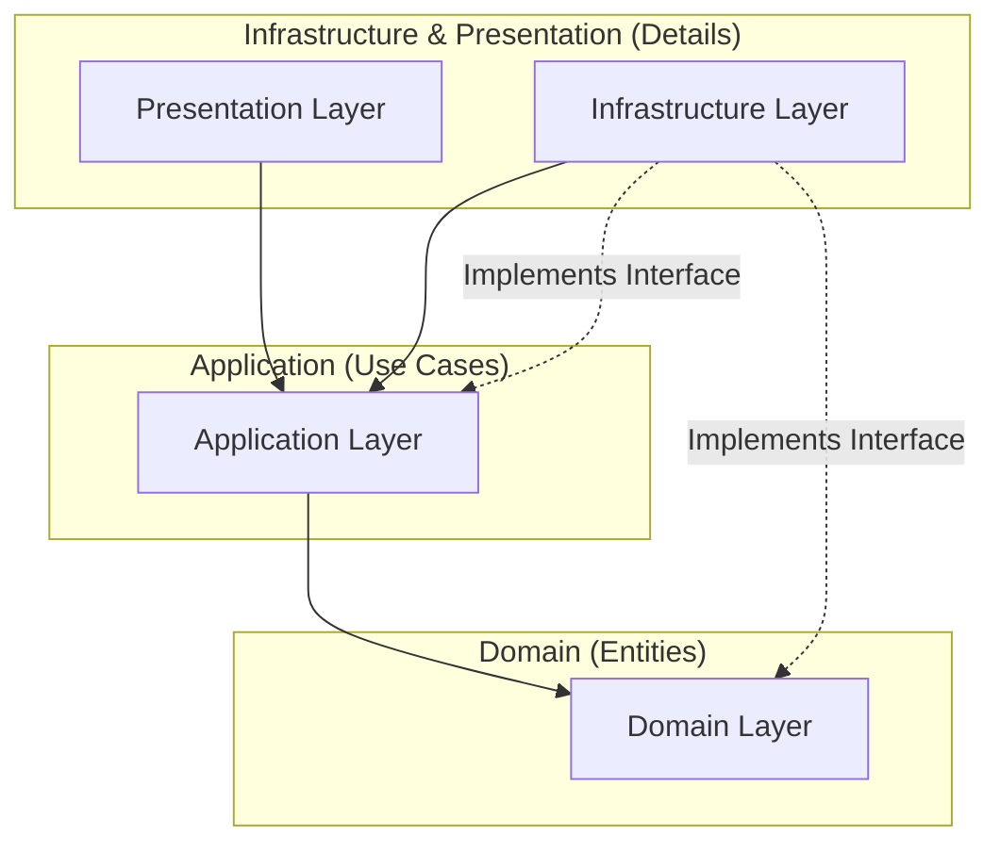

## Directory Structure

```
github/skills/architecture/
├── assets/       # 画像や図などのリソース
├── examples/     # 実装例やサンプルコード
├── references/   # 参考文献やリンク
├── scripts/      # 関連するスクリプト
├── templates/    # テンプレートファイル
└── SKILL.md      # このファイル
```

## When to Use

*   新しい機能やコンポーネントを設計する際
*   既存コードのリファクタリングを行い、構造を整理する際
*   ビジネスロジック、UI、データアクセスの責務を適切に分離したい際
*   依存関係の逆転やインターフェース設計を行う際

## Quick Start

1.  **レイヤーの特定**: 実装する機能がどのレイヤー（Domain, Application, Presentation, Infrastructure）に属するかを判断します。
2.  **依存関係の確認**: 依存関係が常に「外側から内側（詳細から抽象）」に向かっているか確認します。
3.  **インターフェースの定義**: 上位レイヤーが下位レイヤーを利用する場合は、インターフェースを定義して依存関係を逆転させます。
4.  **実装**: 各レイヤーの責務に従ってコードを記述します。

## Guidelines

このプロジェクトでは、関心の分離とテスト容易性を高めるために、クリーンアーキテクチャ（Clean Architecture）の考え方を採用します。
特に、以下の4つのレイヤー（Domain, Application, Presentation, Infrastructure）に基づいた構造と依存関係のルールを定義します。

### レイヤー構造 (Layer Structure)

アーキテクチャは以下の同心円状のレイヤーで構成されます。中心に行くほど抽象度が高く、外側に行くほど具体的になります。



#### 1. Domain Layer (ドメイン層)
**概要:**
ビジネスロジックの中核であり、企業の最重要資産であるビジネスルールやエンティティを定義します。
この層は、アプリケーションの他の部分（データベース、UI、フレームワークなど）について一切の知識を持ちません。
最も安定しており、外部の変更による影響を受けにくい層です。

**主な構成要素:**
*   Entities (エンティティ)
*   Value Objects (値オブジェクト)
*   Domain Services (ドメインサービス)
*   Repository Interfaces (リポジトリインターフェース - 定義のみ)

#### 2. Application Layer (アプリケーション層)
**概要:**
アプリケーション固有のビジネスルール（ユースケース）を定義します。
ドメイン層のエンティティやドメインサービスを使用して、システムが達成すべきタスクを調整・実行します。
UIやデータベースの詳細には依存しませんが、ドメイン層には依存します。

**主な構成要素:**
*   Use Cases / Interactors (ユースケース)
*   Application Services (アプリケーションサービス)
*   DTOs (Data Transfer Objects - プレゼンテーション層とのデータ受け渡し用)
*   Port Interfaces (外部サービスへのインターフェース定義)

#### 3. Presentation Layer (プレゼンテーション層)
**概要:**
ユーザーインターフェース（UI）や外部システムとの接点を担当します。
ユーザーからの入力を受け取り、アプリケーション層のユースケースを実行し、その結果をユーザーに適した形式で表示します。
Webフレームワーク（React, Vueなど）やUIコンポーネントはこの層に含まれます。

**主な構成要素:**
*   Controllers / Presenters
*   Views / UI Components
*   View Models

#### 4. Infrastructure Layer (インフラストラクチャ層)
**概要:**
データベース、外部API、フレームワーク、デバイスなどの詳細な技術的実装を担当します。
アプリケーション層やドメイン層で定義されたインターフェース（RepositoryやPort）を実装します。
この層は最も外側に位置し、変更される可能性が高い詳細部分です。

**主な構成要素:**
*   Database Access (Repository Implementation)
*   External API Clients
*   Framework Configuration
*   System Components (File System, Logger, etc.)

---

### 依存関係のルール (The Dependency Rule)

クリーンアーキテクチャにおける最も重要なルールは、**「ソースコードの依存関係は、常に外側から内側（抽象度の高い方向）へ向かわなければならない」**ということです。

1.  **内側は外側を知らない:**
    *   Domain層やApplication層のコードは、Presentation層やInfrastructure層のクラスや関数、データ構造について一切言及してはいけません。
    *   例えば、Domain層のコード内でSQLクエリを書いたり、HTTPリクエストの詳細を扱ったりすることは禁止です。

2.  **依存関係逆転の原則 (DIP):**
    *   上位レベルのモジュール（Domain/Application）が下位レベルのモジュール（Infrastructure）を直接呼び出す必要がある場合、直接依存するのではなく、上位レベルで**インターフェース**を定義し、下位レベルがそのインターフェースを実装する形をとります。
    *   これにより、制御フロー（Application -> Infrastructure）と依存関係（Infrastructure -> Application）を逆転させ、内側の層を守ります。

3.  **境界を越えるデータ:**
    *   レイヤー間の境界を越えてデータを受け渡す際は、単純なデータ構造（DTOなど）や、内側の層で定義されたオブジェクトを使用します。
    *   データベースのエンティティ（ORMのオブジェクトなど）をそのままUIまで通すようなことは避け、各層に適したデータ形式に変換します。

## Templates

*   `templates/`: アーキテクチャ設計に関連するテンプレートファイルが含まれます。
